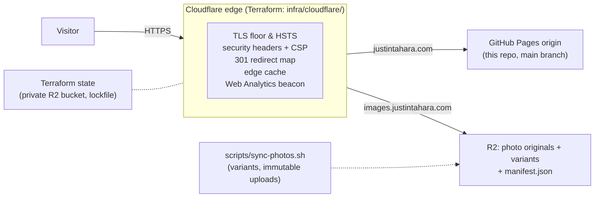

# justin-tahara.github.io

[](https://github.com/justin-tahara/justin-tahara.github.io/actions/workflows/site-ci.yml)
[](https://github.com/justin-tahara/justin-tahara.github.io/actions/workflows/terraform-plan.yml)
[](https://github.com/justin-tahara/justin-tahara.github.io/actions/workflows/edge-verify.yml)
[](https://github.com/justin-tahara/justin-tahara.github.io/actions/workflows/terraform-drift.yml)
[](https://github.com/justin-tahara/justin-tahara.github.io/actions/workflows/link-health.yml)

Personal website / photography portfolio for Justin Tahara, served via GitHub
Pages at **[justintahara.com](https://justintahara.com)** (custom domain in
`CNAME`, fronted by Cloudflare's edge and managed by Terraform in
`infra/cloudflare/`).

The frontend is deliberately simple — static, hand-written HTML/CSS/JS, no
build step. The infrastructure behind it is the other half of the portfolio: a
small but complete production setup — edge-as-code, plan/apply/verify CI, drift
detection — sized for what a personal site actually needs and nothing more.
The reasoning behind each choice is in **[docs/decisions.md](docs/decisions.md)**.

## Architecture



Change flow: a PR gets `site-ci` (links, HTML, Lighthouse) and a commented
`terraform plan`; merging to `main` auto-deploys Pages and runs a
manually-gated `terraform apply`; after every apply, `edge-verify` curls the
live site to prove the edge serves what the code declares. On a schedule,
`terraform-drift` (weekly) catches dashboard drift and `link-health` (weekly)
catches external link rot — each alerts through a single self-closing issue.

## Structure

```
.
├── index.html              # landing page (site root — must stay here)
├── CNAME                   # custom domain (must stay at root)
├── assets/
│   ├── css/styles.css      # shared styles
│   ├── js/script.js        # shared scripts
│   └── images/             # logos/, detail/, profile + standing photos
├── experience/             # per-role detail pages (amazon, applied-intuition, …)
├── papers/                 # academic / course PDFs
├── resume/                 # resume PDF
├── scripts/                # photo publish pipeline (sync-photos.sh)
├── docs/                   # decision log
├── infra/cloudflare/       # Terraform: DNS, edge TLS/cache, headers, redirects, R2, analytics
└── .github/workflows/      # CI/CD (see below)
```

## Local preview

```sh
python3 -m http.server 8000   # then open http://localhost:8000
```

Paths are root-relative the same way GitHub Pages serves them, so previewing from
the repo root matches production.

## Infrastructure & CI/CD

The site is plain GitHub Pages, hardened and automated around the edges:

- **DNS + edge as code** — `infra/cloudflare/` is Terraform (remote state in a
  private R2 bucket, native lockfile). It manages DNS, zone TLS settings,
  caching, security headers + a tailored Content-Security-Policy, 301 redirects
  for the old (pre-restructure) URLs, the R2 photo bucket behind
  `images.justintahara.com`, and privacy-first Web Analytics. See
  `infra/cloudflare/README.md`.
- **`terraform-plan`** comments a plan on every PR touching the module;
  **`terraform-apply`** applies on merge to `main`, gated by the `production`
  GitHub Environment (manual approval) so edge changes never ship unattended.
- **`edge-verify`** runs after every successful apply and daily: credential-free
  curl assertions that production actually serves what the module declares —
  redirects, headers, TLS floor, cache status. The apply proves the API accepted
  the config; this proves the site behaves.
- **`terraform-drift`** plans against live weekly; **`link-health`** sweeps all
  links (external included) weekly. Both alert via a single labeled issue that
  updates in place and closes itself when the check comes back clean.
- **`site-ci`** gates every content PR: broken-link check (lychee), HTML
  validation, and a Lighthouse report (perf/a11y/SEO/best-practices).
- **Deploy** is GitHub Pages' built-in pipeline — merging to `main` publishes
  automatically within ~a minute. No deploy workflow needed.
- **Photos** never enter git: `scripts/sync-photos.sh` generates responsive
  variants locally, uploads them (immutable) to R2, and publishes the
  `manifest.json` the photography pages read.
